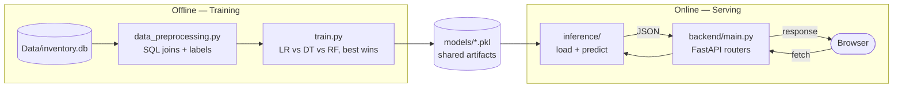

 
<div align="center">

[](https://invoice-intelligence-system-8r36.onrender.com)


**A full-stack ML system that predicts freight cost and flags high-risk invoices for manual review — trained on 5,543 real vendor invoices, served through a live FastAPI backend and a custom dark-themed frontend.**

</div> 

---

## Table of Contents

- [Overview](#overview)
- [Live Demo](#live-demo)
- [Key Features](#key-features)
- [Architecture](#architecture)
- [Tech Stack](#tech-stack)
- [Project Structure](#project-structure)
- [Dataset](#dataset)
- [Model Performance](#model-performance)
- [Getting Started](#getting-started)
- [API Reference](#api-reference)
- [Training the Models (Optional)](#training-the-models-optional)
- [Testing](#testing)
- [Deployment](#deployment)
- [Engineering Notes](#engineering-notes)
- [Limitations & Future Work](#limitations--future-work)
- [License](#license)
- [Connect](#connect)

---

## Overview

Invoice Intelligence System wraps two production `scikit-learn` models behind a REST API:

1. **Freight Cost Regression** — predicts freight cost from an invoice's dollar amount before a shipment ships. (Linear Regression, **R² = 96.99%**)
2. **Invoice Risk Classification** — flags invoices likely to need manual review before they're paid. (Random Forest, **77.55% accuracy**, **99.27% precision** on flagged invoices)

Both are trained offline against a real procurement SQLite database, then served by a FastAPI backend that a hand-built, dark-themed frontend calls live — no mock data, no static demo screenshots standing in for the real thing.

## Live Demo

**[invoice-intelligence-system-8r36.onrender.com](https://invoice-intelligence-system-8r36.onrender.com)**

This README intentionally skips screenshots — the entire point of the project is that it's alive. Try both models directly on the link above, including a drag-and-drop CSV batch upload for the risk classifier — or run it locally in under two minutes ([Getting Started](#getting-started)) to see the code path yourself.

> Hosted on Render's free tier, so if the app has been idle the first request can take 30–50s to spin back up. It's fast on every request after that.

## Key Features

- 🔮 **Two live ML models** served over a documented REST API, not notebooks-as-demos
- 📦 **Batch invoice scoring** — upload a CSV, get risk predictions and summary stats for every row
- 📊 **Real, reproducible metrics** — every number on the site and in this README comes from re-running the actual training pipeline against the actual held-out test split
- 🎨 **Custom dark UI** — no template, no component library; hand-built HTML/CSS/JS with a ledger/audit-stamp visual motif
- 🐳 **One-command deploy** — a single Docker container serves both the API and the frontend
- ✅ **26 passing tests** — unit tests on the inference layer, integration tests on every API route

## Architecture

Training happens offline against the SQLite database; serving happens online against the same trained artifacts. The API has no runtime dependency on the database — only on the small `.pkl` files already committed in [`/models`](models).



## Tech Stack

| Layer | Technology |
|---|---|
| **Backend** | Python 3.11, FastAPI, Pydantic v2, Uvicorn |
| **ML** | scikit-learn 1.6, pandas, NumPy, joblib |
| **Frontend** | Vanilla HTML / CSS / JavaScript (no framework, no build step) |
| **Data** | SQLite (offline training only) |
| **Testing** | pytest, httpx, FastAPI `TestClient` |
| **Deployment** | Docker, Render (blueprint included), Railway/Heroku-style (`Procfile`) |
| **Fonts** | Fraunces (display), IBM Plex Sans (body), IBM Plex Mono (data) |

## Project Structure

```
invoice-intelligence-system/
├── backend/                     # FastAPI application
│   ├── main.py                  # App entrypoint — routers + static frontend mount
│   ├── config.py                # Paths, CORS, env-based settings
│   ├── schemas.py                # Pydantic request/response models
│   ├── model_metrics.py         # Real test-set metrics served by /api/models/info
│   └── routers/
│       ├── freight.py           # POST /api/predict/freight-cost
│       └── invoice_risk.py      # POST /api/predict/invoice-risk (+ /batch)
│
├── inference/                   # Thin prediction layer used by the API
│   ├── predict_freight.py
│   └── predict_invoice_flag.py
│
├── freight_cost_prediction/     # Training pipeline — freight regressor
│   ├── data_preprocessing.py
│   ├── modeling_evaluation.py
│   └── train.py
│
├── invoice_flagging/            # Training pipeline — risk classifier
│   ├── data_preprocessing.py
│   ├── modeling_evaluation.py
│   └── train.py
│
├── models/                      # Trained artifacts (committed — <450KB total)
│   ├── predict_freight_model.pkl
│   ├── predict_flag_invoice.pkl
│   └── scaler.pkl
│
├── frontend/                    # Static dark-themed UI, served by FastAPI
│   ├── index.html
│   ├── css/styles.css
│   ├── js/app.js
│   └── samples/                 # Sample CSV for the batch-upload demo
│
├── Notebook/                    # Original EDA & model exploration
│   ├── Invoice_Flagging.ipynb
│   └── Predicting Freight Cost.ipynb
│
├── Data/                        # Dataset docs + small real samples (full DB excluded, see below)
├── tests/                       # pytest suite (26 tests)
├── requirements.txt
├── Dockerfile
├── render.yaml                  # Render.com blueprint
└── Procfile                     # Railway / Heroku-style platforms
```

## Dataset

Both models train on **[Vendor Performance Analysis](https://www.kaggle.com/datasets/harshmadhavan/vendor-performance-analysis)**, a public procurement dataset (SQLite, 5 tables, ~400MB). The full database isn't committed to this repo — GitHub rejects files over 100MB, and the running application doesn't need it anyway, only the trained `.pkl` files in `/models`. Full schema, sourcing, and small real CSV samples are documented in **[`Data/README.md`](Data/README.md)**.

| | Rows used |
|---|---|
| `vendor_invoice` | 5,543 |
| `purchases` | 2,372,474 |

## Model Performance

Real test-set metrics, reproduced by running the actual training pipeline (80/20 split, `random_state=42`) — not cherry-picked numbers.

### Freight Cost Regression

| Algorithm | MAE | RMSE | R² |
|---|---|---|---|
| **Linear Regression** ✅ | **$24.11** | **$124.72** | **96.99%** |
| Random Forest | $26.13 | $134.79 | 96.48% |
| Decision Tree | $32.97 | $150.31 | 95.63% |

Selection rule (`train.py`): lowest MAE on the held-out test set. Freight scales almost linearly with invoice value in this dataset, so the simplest model wins fair and square.

### Invoice Risk Classification

| Algorithm | Accuracy | F1 (flagged class) |
|---|---|---|
| **Random Forest** (`max_depth=6`) ✅ | **77.55%** | **52.21%** |
| Decision Tree | 70.78% | 27.35% |
| Logistic Regression | 65.46% | 1.54% |

**Confusion matrix** (test set, n=1,109):

| | Predicted: Not Flagged | Predicted: Flagged |
|---|---|---|
| **Actual: Not Flagged** | 724 (TN) | 1 (FP) |
| **Actual: Flagged** | 248 (FN) | 136 (TP) |

| Class | Precision | Recall | F1 |
|---|---|---|---|
| Not flagged | 74.49% | 99.86% | 85.33% |
| Flagged | 99.27% | 35.42% | 52.21% |

**Feature importance:**

```
total_item_dollars    ██████████████████░░░░░░░░░░  29.68%
invoice_dollars        █████████████░░░░░░░░░░░░░░░  21.70%
total_item_quantity    █████████████░░░░░░░░░░░░░░░  20.99%
invoice_quantity       █████████░░░░░░░░░░░░░░░░░░░  14.85%
Freight                ████████░░░░░░░░░░░░░░░░░░░░  12.78%
```

> **Reading these numbers honestly:** this model is tuned toward precision over recall. When it flags an invoice, it's right ~99% of the time — but it only catches ~35% of invoices that should be flagged. See [Limitations & Future Work](#limitations--future-work) for why, and what would likely fix it.

## Getting Started

```bash
# 1. Clone and enter the repo
git clone https://github.com/AbhishekGrover1/invoice-intelligence-system.git
cd invoice-intelligence-system

# 2. Create a virtual environment
python3 -m venv venv
source venv/bin/activate        # Windows: venv\Scripts\activate

# 3. Install dependencies
pip install -r requirements.txt

# 4. Run the app (backend + frontend, one process)
uvicorn backend.main:app --reload

# 5. Open http://localhost:8000
```

No database, no environment variables, and no extra setup required — the trained models are already in `/models`.

## API Reference

Full interactive documentation (Swagger UI) is available at **`/api/docs`** once the app is running.

| Method | Endpoint | Description |
|---|---|---|
| `GET` | `/api/health` | Service + model load status |
| `GET` | `/api/models/info` | Real metrics for both models (powers the Performance section above) |
| `POST` | `/api/predict/freight-cost` | Predict freight cost from an invoice amount |
| `POST` | `/api/predict/invoice-risk` | Evaluate a single invoice's manual-review risk |
| `POST` | `/api/predict/invoice-risk/batch` | Evaluate many invoices from an uploaded CSV |

<details>
<summary><strong>Example — freight cost</strong></summary>

```bash
curl -X POST http://localhost:8000/api/predict/freight-cost \
  -H "Content-Type: application/json" \
  -d '{"dollars": 18500}'
```

```json
{
  "dollars": 18500.0,
  "predicted_freight": 97.79,
  "freight_ratio_pct": 0.529
}
```
</details>

<details>
<summary><strong>Example — invoice risk</strong></summary>

```bash
curl -X POST http://localhost:8000/api/predict/invoice-risk \
  -H "Content-Type: application/json" \
  -d '{
    "invoice_quantity": 120,
    "invoice_dollars": 5400.0,
    "freight": 210.0,
    "total_item_quantity": 118,
    "total_item_dollars": 5390.0
  }'
```

```json
{
  "flagged": false,
  "risk_label": "Auto-Approved",
  "flag_probability": 0.3126,
  "confidence_pct": 68.74
}
```
</details>

<details>
<summary><strong>Example — batch CSV</strong></summary>

```bash
curl -X POST http://localhost:8000/api/predict/invoice-risk/batch \
  -F "file=@Data/samples/invoice_risk_batch_sample.csv"
```

CSV must contain columns: `invoice_quantity, invoice_dollars, Freight, total_item_quantity, total_item_dollars`.
</details>

## Training the Models (Optional)

The app runs fine without ever touching this — it's only needed if you want to retrain on updated data.

```bash
# 1. Get the dataset (see Data/README.md) and place it at Data/inventory.db

# 2. Train the freight regressor
python freight_cost_prediction/train.py

# 3. Train the invoice risk classifier
python invoice_flagging/train.py
```

Both scripts resolve every path relative to the project root, so they behave identically whether run from the repo root or from inside their own folder — and both always save to the shared `/models` directory.

## Testing

```bash
pytest tests/ -v
```

26 tests: unit tests on the inference layer (`tests/test_inference.py`) using real examples pulled from the actual held-out test split, and integration tests on every API route (`tests/test_api.py`), including validation-error and malformed-CSV cases.

## Deployment

**Docker (recommended — one container, both frontend and API):**

```bash
docker build -t invoice-intelligence-system .
docker run -p 8000:8000 invoice-intelligence-system
```

**Render.com:** connect the repo — `render.yaml` is picked up automatically as a Blueprint. (This is how the [live demo](https://invoice-intelligence-system-8r36.onrender.com) above is deployed.)

**Railway / Heroku-style platforms:** connect the repo — `Procfile` is picked up automatically.

**Manual (any VM):**

```bash
pip install -r requirements.txt
uvicorn backend.main:app --host 0.0.0.0 --port $PORT
```

## Engineering Notes

A few things worth knowing if you're reading the code closely — this project started as a working prototype, and these are the fixes made to bring it to this state:

- **Fixed a broken model path.** The inference layer originally looked for trained models inside `inference/models/`, a folder that never existed — every prediction request threw `FileNotFoundError`. Both inference modules now resolve models from the project's single shared `/models` directory.
- **Consolidated model storage.** The freight regressor previously saved to `freight_cost_prediction/models/`, while the other two artifacts saved to a root-level `models/`. All three now live in one place, and both `train.py` scripts resolve paths relative to the project root (`Path(__file__)`) instead of the working directory they happen to be launched from.
- **Added in-memory model caching.** Both inference modules now cache the loaded model/scaler with `functools.lru_cache` instead of reading the pickle file from disk on every request.
- **Pinned scikit-learn to match training.** The shipped `.pkl` files were trained with scikit-learn 1.6.1; `requirements.txt` pins that exact version so there's no `InconsistentVersionWarning` at runtime.
- **Reported the real, shipped model's metrics — not the best-looking ones available.** `Notebook/Invoice_Flagging.ipynb` explores stronger configurations than what's actually in `models/predict_flag_invoice.pkl`: the same 5 features without the `max_depth=6` cap reaches 88.37% accuracy (81% F1 on the flagged class), and the full 9-feature set — adding `avg_receiving_delay`, `days_po_to_invoice`, `days_to_pay`, and `total_brands` — reaches 96% accuracy (93% F1). The numbers in this README and on the live demo are for the model that's actually running, not the strongest one explored.

## Limitations & Future Work

- **Recall on flagged invoices is the known weak point** (35.42%). The model is precise but conservative — it under-flags. The notebook results above suggest two concrete paths to improve it: drop the `max_depth=6` cap (recovers ~29 points of F1 on the flagged class with the same 5 features), or reintroduce `avg_receiving_delay`, which was the single strongest predictor in exploratory testing but isn't in the production feature set — worth revisiting whether it's reliably available at the moment an invoice actually needs evaluating.
- **Freight cost model uses one feature on purpose.** `Quantity` was in the original data but correlates heavily with `Dollars` and added no predictive value in testing, so it isn't collected in the UI or API — asking for it would imply it affects the prediction when it doesn't.
- **No authentication.** This is a portfolio/demo deployment. Add an API key or OAuth layer before handling real invoice data.
- **Batch upload caps at 5,000 rows per request** — fine for ad-hoc review, not for a nightly bulk job. A queued/async version would be the next step for production scale.

## License

MIT — see [LICENSE](LICENSE).

## Connect

<div align="center">

Built by **Abhishek Grover** — AI/ML Engineer

[](https://github.com/AbhishekGrover1)
[](https://linkedin.com/in/abhishek-grover07)
[](mailto:ss107456@gmail.com)

*— Abhishek Grover*

</div>


